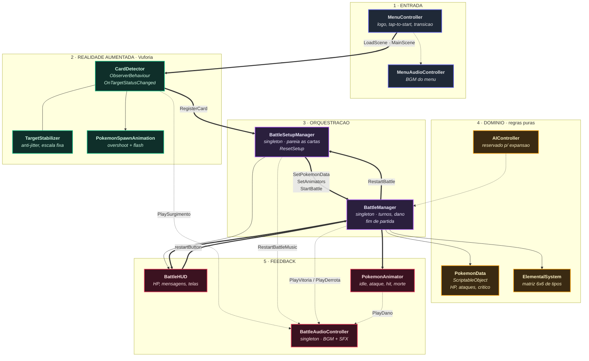
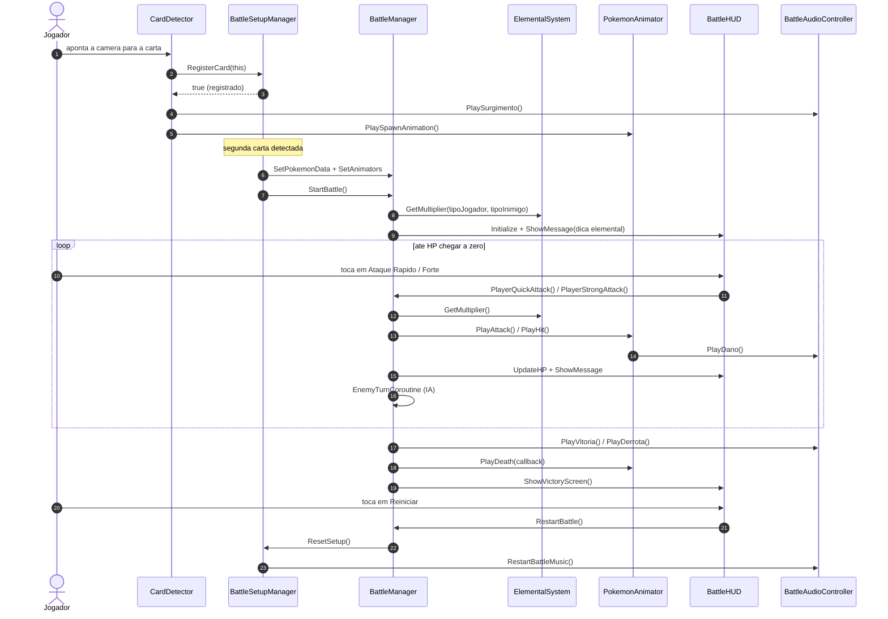

# BattleARena

Jogo de batalha de Pokémon em **Realidade Aumentada**, desenvolvido em Unity com Vuforia Engine. O jogador aponta a câmera do celular para cartas físicas, os Pokémon surgem em 3D sobre elas, e a batalha por turnos acontece em cima da mesa.

<div align="center">

`Unity 6` · `Vuforia 11.4.4` · `C#` · `TextMeshPro` · `New Input System`

</div>

---

## Equipe

Projeto acadêmico desenvolvido em grupo. 

| Nome | Matrícula |
|---|---|
| Manoela Garcia | 222015186 |
| Thales Euflauzino | 222006178 |
| Victor Bernardes | 222029243 |
| Vitor Lages | 242025054 |

---

## Índice

- [Como funciona](#como-funciona)
- [Arquitetura](#arquitetura)
- [Fluxo de uma partida](#fluxo-de-uma-partida)
- [Sistema elemental](#sistema-elemental)
- [Sistema de combate](#sistema-de-combate)
- [Estrutura de pastas](#estrutura-de-pastas)
- [Scripts](#scripts)
- [Como rodar](#como-rodar)
- [Como adicionar um novo Pokémon](#como-adicionar-um-novo-pokémon)
- [Decisões técnicas](#decisões-técnicas)
- [Limitações e trabalhos futuros](#limitações-e-trabalhos-futuros)
- [Equipe](#equipe)

---

## Como funciona

1. O jogador abre o app e toca na tela inicial.
2. Aponta a câmera para a **sua carta**. O Pokémon surge em 3D sobre o marcador, com animação de spawn e som de surgimento.
3. Aponta para a **carta do oponente**. O segundo Pokémon surge e a batalha começa automaticamente.
4. A batalha é **por turnos**: o jogador escolhe entre Ataque Rápido e Ataque Forte, e a IA responde.
5. Dano, críticos e vantagem elemental são calculados e exibidos na HUD.
6. Quem zerar o HP primeiro perde. Uma tela de vitória/derrota aparece com botão de reinício.

---

## Arquitetura

O projeto é organizado em **cinco camadas**, com dependência sempre no sentido de cima para baixo. As camadas de domínio e feedback não conhecem a camada de AR, o que mantém as regras de jogo testáveis e independentes do Vuforia.



| Seta | Significado |
|---|---|
| Grossa | Fluxo principal de controle |
| Fina | Dependência de dados ou leitura |
| Tracejada | Chamada de áudio via Singleton (acoplamento fraco) |

---

## Fluxo de uma partida



---

## Sistema elemental

Matriz 6x6 estática, com acesso O(1). A leitura é **linha ataca coluna**.

|  | Fogo | Planta | Água | Elétrico | Voador | Pedra |
|---|:---:|:---:|:---:|:---:|:---:|:---:|
| **Fogo** | 1x | **2x** | 1x | 1x | 1x | 1x |
| **Planta** | 1x | 1x | **2x** | 1x | 1x | **2x** |
| **Água** | **2x** | 1x | 1x | 1x | 1x | 1x |
| **Elétrico** | 1x | 1x | **2x** | 1x | **2x** | 1x |
| **Voador** | 1x | **2x** | 1x | 1x | 1x | **2x** |
| **Pedra** | **2x** | 1x | 1x | **2x** | 1x | 1x |

O multiplicador é aplicado depois do crítico, e a HUD sinaliza `[SUPER EFICAZ!]` quando o valor é maior ou igual a 2x.

---

## Sistema de combate

O dano é calculado em três etapas, em `BattleManager.CalculateDamageWithElemental()`:

```
1. Dano base      → Random.Range(minDamage, maxDamage + 1)
2. Crítico        → if (Random.value < criticalChance) dano *= criticalMultiplier
3. Elemental      → dano *= ElementalSystem.GetMultiplier(atacante, defensor)
```

Valores padrão de um `PokemonData`:

| Atributo | Padrão |
|---|---|
| `baseHP` | 100 |
| Ataque Rápido | 10 a 14 de dano |
| Ataque Forte | 28 a 35 de dano |
| Chance de crítico | 10% |
| Multiplicador de crítico | 2x |
| Delay da IA | 2.0 s |

**IA do oponente**: a cada turno, 40% de chance de usar Ataque Forte e 60% de usar Ataque Rápido, após aguardar `aiAttackDelay` segundos. O `AIController` está reservado para comportamentos mais elaborados no futuro.

---

## Estrutura de pastas

```
Assets/
├── Scenes/
│   ├── MenuScene.unity      # tela inicial
│   └── MainScene.unity      # cena de batalha AR
├── Scripts/
│   ├── AI/
│   │   └── AIController.cs
│   ├── AR/
│   │   ├── BattleSetupManager.cs
│   │   ├── CardDetector.cs
│   │   ├── PokemonSpawnAnimation.cs
│   │   └── TargetStabilizer.cs
│   ├── Animation/
│   │   └── PokemonAnimator.cs
│   ├── Audio/
│   │   └── BattleAudioController.cs
│   ├── Battle/
│   │   ├── BattleManager.cs
│   │   ├── ElementalSystem.cs
│   │   └── PokemonData.cs
│   └── UI/
│       ├── BattleHUD.cs
│       ├── MenuAudioController.cs
│       └── MenuController.cs
├── Resources/
└── Packages/
```

---

## Scripts

| Script | Namespace | Responsabilidade |
|---|---|---|
| `MenuController` | `BattleARena.UI` | Animação de entrada do logo, detecção de toque, transição para a `MainScene` |
| `MenuAudioController` | `BattleARena.UI` | BGM do menu com fade-in e fade-out |
| `CardDetector` | `BattleARena.AR` | Escuta `OnTargetStatusChanged` do Vuforia, registra a carta e dispara o spawn |
| `TargetStabilizer` | `BattleARena.AR` | Trava a escala do modelo e suaviza a posição para reduzir jitter de tracking |
| `PokemonSpawnAnimation` | `BattleARena.AR` | Animação de surgimento em duas fases (overshoot) com flash de material |
| `BattleSetupManager` | `BattleARena.AR` | Singleton. Pareia jogador e inimigo, inicia e reseta a partida |
| `BattleManager` | `BattleARena.Battle` | Singleton. Turnos, cálculo de dano, IA, condição de vitória |
| `PokemonData` | `BattleARena.Battle` | `ScriptableObject` com atributos de cada Pokémon |
| `ElementalSystem` | `BattleARena.Battle` | Classe estática com a matriz de vantagens de tipo |
| `AIController` | `BattleARena.AI` | Placeholder para IA avançada |
| `PokemonAnimator` | `BattleARena.Animation` | Animação procedural: idle, ataque, hit e morte, sem Animator Controller |
| `BattleHUD` | `BattleARena.UI` | Barras de HP, mensagens, telas de scan e de vitória |
| `BattleAudioController` | `BattleARena.Audio` | Singleton. BGM com fade e SFX de surgimento, dano, vitória e derrota |

---

## Como rodar

### Requisitos

- **Unity 6000.4.11f1** (Unity 6)
- Módulo de build **Android** ou **iOS** instalado
- Conta no [Vuforia Developer Portal](https://developer.vuforia.com/) para gerar a license key
- Dispositivo físico com câmera (o Vuforia não roda bem no Editor sem webcam configurada)

### Passos

```bash
git clone https://github.com/thaleseuflauzino/BattleARena.git
```

1. Abra o projeto pelo **Unity Hub** com a versão 6000.4.11f1.
2. Aguarde a importação do pacote `com.ptc.vuforia.engine` (já incluso como `.tgz` em `Packages/`).
3. Configure a license key: `Window > Vuforia Configuration > App License Key`.
4. Abra `Assets/Scenes/MenuScene.unity`.
5. Rode no Editor com uma webcam, ou faça `File > Build and Run` para Android/iOS.
6. Aponte a câmera para as cartas do banco de imagens do projeto.

---

## Como adicionar um novo Pokémon

1. **Criar os dados**: `Assets > Create > BattleARena > Pokemon Data`. Preencha nome, tipo elemental, HP, faixas de dano e chance de crítico.
2. **Criar o Image Target**: adicione a imagem da carta ao banco no Vuforia Portal, baixe o pacote e importe na cena.
3. **Montar o objeto**: adicione o componente `CardDetector` ao Image Target e ligue o `PokemonData` criado.
4. **Adicionar o modelo 3D** como filho do Image Target, com os componentes:
   - `TargetStabilizer` (escala fixa e anti-jitter)
   - `PokemonSpawnAnimation` (surgimento)
   - `PokemonAnimator` (escolha entre `Biped`, `Quadruped` ou `Flying`)
5. **Referencie o modelo** no campo `pokemonModel` do `CardDetector`.

Nenhuma linha de código precisa ser alterada.

---

## Decisões técnicas

**ScriptableObject para os dados dos Pokémon.** Separa dados de comportamento. Quem faz balanceamento edita valores no Inspector sem recompilar o projeto, e os assets são compartilhados entre cenas sem duplicação de memória.

**Animação procedural em vez de Animator Controller.** Os modelos 3D usados não vêm com rigging nem clipes de animação. Toda a movimentação (idle com bob senoidal, avanço de ataque, recoil de hit, tombamento na morte) é feita em coroutines manipulando `transform`, com três perfis distintos por morfologia.

**Matriz estática para o sistema elemental.** `float[,]` com acesso por cast do enum para índice. Custo O(1), zero alocação, e a tabela fica visualmente legível no próprio código.

**Singletons para os managers.** `BattleManager`, `BattleSetupManager` e `BattleAudioController` são singletons porque precisam ser alcançáveis a partir de objetos criados dinamicamente pelo tracking do Vuforia, onde arrastar referências pelo Inspector não é viável.

**Reinício sem recarregar a cena.** `RestartBattle()` chama `ResetSetup()` em vez de `SceneManager.LoadScene()`. Recarregar a cena forçaria a reinicialização de todo o pipeline do Vuforia (câmera, banco de targets, tracking), o que é caro e provoca um congelamento visível. O custo dessa escolha é que os métodos `Start()` não rodam de novo, então todo estado precisa ser explicitamente resetado, incluindo a música de fundo, via `RestartBattleMusic()`.

**Anti-jitter no `TargetStabilizer`.** O tracking do Vuforia oscila alguns milímetros por frame, o que faz o modelo tremer. A escala é reafirmada todo `Update()` e a posição é interpolada com `Vector3.Lerp`, trocando responsividade por estabilidade visual.

---

## Limitações e trabalhos futuros

- [ ] IA reativa em `AIController` (priorizar ataque forte com o oponente em HP baixo, considerar vantagem de tipo)
- [ ] Multiplayer local com duas cartas de jogadores reais
- [ ] Sistema de habilidades e status (queimadura, paralisia)
- [ ] Persistência de vitórias e derrotas
- [ ] Sprite Asset do TextMeshPro para emojis na HUD
- [ ] Interromper coroutines de batalha em voo ao reiniciar a partida
- [ ] Suporte a mais de duas cartas simultâneas em cena

---

